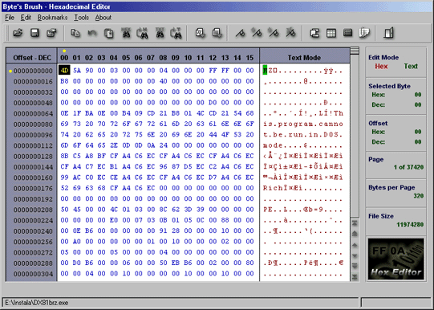



## HexEditor

### Description

For the byte's lovers, another HexaEdit, still in BETA version.

Features: It can edit in hex and char mode, can select blocks of bytes,

find and replace bytes and char, multi-language, conversor of numeric

bases, etc...
 
### More Info
 

             |
---                |---
**Submitted On**   |2002-06-04 22:00:30
**By**             |[Arruda](https://github.com/Planet-Source-Code/PSCIndex/blob/master/ByAuthor/arruda.md)
**Level**          |Advanced
**User Rating**    |5.0 (360 globes from 72 users)
**Compatibility**  |VB 5\.0, VB 6\.0
**Category**       |[Complete Applications](https://github.com/Planet-Source-Code/PSCIndex/blob/master/ByCategory/complete-applications__1-27.md)
**World**          |[Visual Basic](https://github.com/Planet-Source-Code/PSCIndex/blob/master/ByWorld/visual-basic.md)
**Archive File**   |[HexEditor90331642002\.zip](https://github.com/Planet-Source-Code/arruda-hexeditor__1-34432/archive/master.zip)

